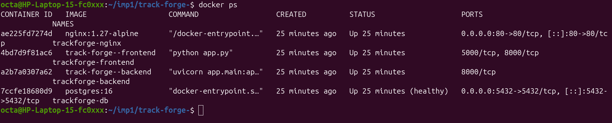
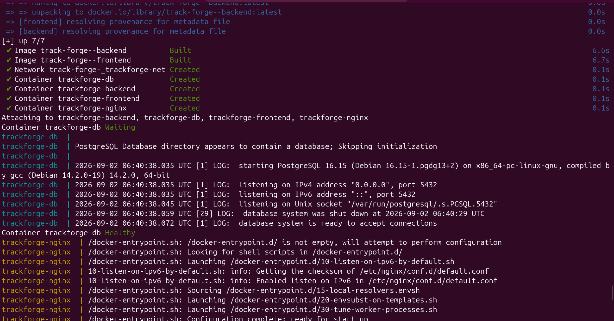
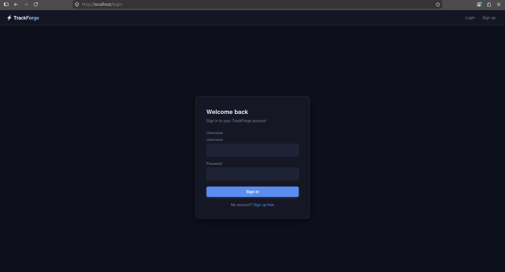

# TrackForge — Docker & Nginx Setup

This document covers the containerization work done for TrackForge so far:
Dockerizing the backend/frontend, wiring them together with Docker Compose,
and adding an Nginx reverse proxy in front of both services.

## 1. Dockerfile (backend & frontend)

- Multi-stage `Dockerfile` for both `backend/` and `frontend/`:
  - **Stage 1 (builder)** — installs Python dependencies with
    `pip install --user --no-cache-dir -r requirements.txt`.
  - **Stage 2 (runtime)** — uses a `python:3.12-slim` base, copies only the
    installed packages from the builder stage, then copies the app code.
- Backend runs via `uvicorn app.main:app --host 0.0.0.0 --port 8000`.
- Frontend runs via `python app.py`, listening on `0.0.0.0:5000`.
- Images built locally and pushed to Docker Hub:
  `apurv25/trackforge-backend` and `apurv25/trackforge-frontend`.

## 2. Docker Compose

- `docker-compose.yml` orchestrates three app-level services plus nginx, all on
  a shared bridge network (`trackforge-net`):
  - **db** — Postgres 16, with a healthcheck (`pg_isready`) so dependent
    services wait until it's actually ready, not just started.
  - **backend** — built from `backend/Dockerfile`, reads config from
    `backend/.env`, connects to `db` via `DATABASE_URL`.
  - **frontend** — built from `frontend/Dockerfile`, reads config from
    `frontend/.env`, calls the backend via `API_BASE_URL`.
- Backend and frontend don't publish ports directly to the host (`expose`
  instead of `ports`) — all external traffic goes through nginx.

## 3. Nginx reverse proxy

- Added an `nginx` service (`nginx:1.27-alpine`), the only container exposing
  a port to the host (`80`), using a mounted `nginx.conf`.
- Routing:
  - `/api/` → backend (`backend:8000`)
  - `/docs` → backend's FastAPI docs
  - `/` → frontend (`frontend:5000`)
- Fixed a port mismatch bug during setup: frontend's `app.run()` was listening
  on `5000`, while nginx/compose were initially wired for `8000` — corrected
  the upstream and `expose` port to `5000` to resolve a 502 Bad Gateway.

## Screenshots

### Container list
`docker compose ps` showing all containers running.



### Docker logs
Container logs showing services starting up cleanly.



### Nginx serving the app
App accessible through nginx on `http://localhost`.



## How to run it

```bash
git clone <repo-url>
cd track-forge-

# create backend/.env and frontend/.env yourself (not committed — see .gitignore)
# backend/.env needs: DATABASE_URL, SECRET_KEY
# frontend/.env needs: API_BASE_URL, API_TIMEOUT_SECONDS, FRONTEND_SECRET_KEY

docker compose up --build
```

Visit `http://localhost` once all containers are up.
