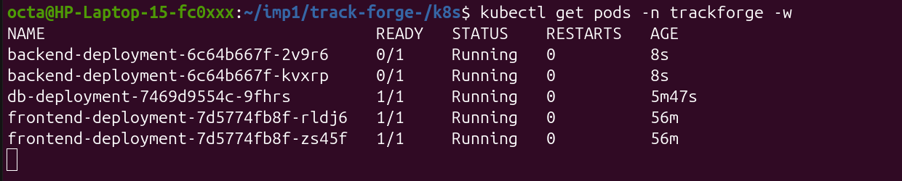
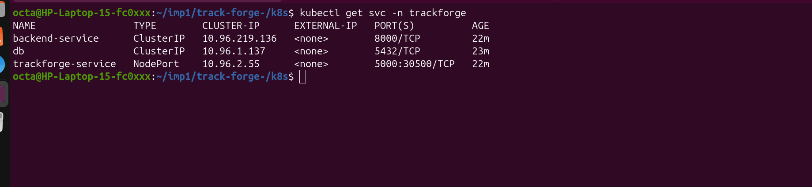
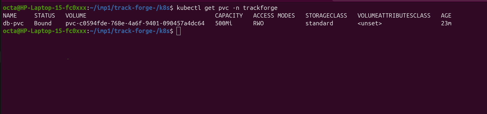
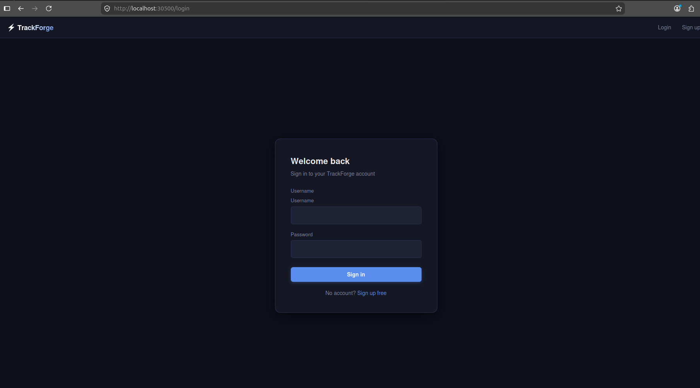

# TrackForge — Kubernetes Setup

This document covers moving TrackForge from Docker Compose to a local Kubernetes
cluster using **kind** (Kubernetes in Docker) — namespace, Postgres, backend,
frontend, storage, config, and secrets, all wired together and reachable via
NodePort.

## Architecture

```
                        ┌─────────────────────────────┐
                        │   kind cluster: trackforge   │
                        │   namespace: trackforge      │
                        │                              │
  localhost:30500 ─────▶│  frontend-service (NodePort) │
                        │        │                     │
                        │        ▼                     │
                        │  frontend-deployment (x2)     │
                        │        │                     │
                        │        ▼                     │
                        │  backend-service (ClusterIP)  │
                        │        │                     │
                        │        ▼                     │
                        │  backend-deployment (x2)      │
                        │        │                     │
                        │        ▼                     │
                        │  db (ClusterIP) ──▶ db-deployment │
                        │        │                     │
                        │        ▼                     │
                        │      db-pvc (500Mi)           │
                        └─────────────────────────────┘
```

## Prerequisites

- Docker installed and running
- `kind` installed (`kind version` to check)
- `kubectl` installed (`kubectl version --client` to check)

## Files in this setup

| File | What it does |
|---|---|
| `kind-config.yaml` | Defines the cluster and maps host ports (80, 443, 30500) into it |
| `k8s/namespace.yml` | Creates the `trackforge` namespace |
| `k8s/persistentvolumeclaim.yml` | Requests 500Mi of storage for Postgres data |
| `k8s/ConfigMap.yml` | Non-sensitive Postgres config (`POSTGRES_USER`, `POSTGRES_DB`) |
| `k8s/secrets.yml` | Sensitive Postgres config (`POSTGRES_PASSWORD`) — **not committed**, see `secrets.yml.example` |
| `k8s/postgres-deployment.yml` | Runs Postgres 16, mounts the PVC, has readiness/liveness probes |
| `k8s/postgres_service.yml` | ClusterIP service named `db` — internal DNS name backend connects to |
| `k8s/backend-deployment.yml` | Runs the FastAPI backend (2 replicas), connects to `db`, has probes |
| `k8s/backend-service.yml` | ClusterIP service exposing the backend internally on port 8000 |
| `k8s/frontend-deployment.yml` | Runs the Flask frontend (2 replicas), has probes |
| `k8s/frontend-service.yml` | NodePort service — exposes the frontend on `localhost:30500` |

## Step-by-step setup

### 1. Create the kind cluster
```bash
cd ~/imp1/track-forge-
kind create cluster --config kind-config.yaml
kubectl cluster-info --context kind-trackforge
kubectl get nodes
```

### 2. Create the namespace
```bash
cd k8s
kubectl apply -f namespace.yml
kubectl get namespaces
```

### 3. Set up storage
```bash
kubectl apply -f persistentvolumeclaim.yml
kubectl get pvc -n trackforge
```
`STATUS` should show `Bound` — kind's default StorageClass (`standard`)
provisions the volume automatically, no manual `PersistentVolume` needed.

### 4. Add config and secrets
```bash
kubectl apply -f ConfigMap.yml

# secrets.yml is gitignored — create your own from the example first:
# cp secrets.yml.example secrets.yml   (then fill in a real password)
kubectl apply -f secrets.yml
```

### 5. Deploy Postgres
```bash
kubectl apply -f postgres-deployment.yml
kubectl apply -f postgres_service.yml
kubectl get pods -n trackforge -w
```
Wait until the `db-deployment` pod shows `Running` before continuing —
the backend depends on it.

### 6. Deploy the backend
```bash
kubectl apply -f backend-deployment.yml
kubectl apply -f backend-service.yml
kubectl get pods -n trackforge -w
```

### 7. Deploy the frontend
```bash
kubectl apply -f frontend-deployment.yml
kubectl apply -f frontend-service.yml
kubectl get pods -n trackforge
```

### 8. Verify everything is up
```bash
kubectl get pods -n trackforge
kubectl get svc -n trackforge
kubectl get pvc -n trackforge
```
All pods should show `1/1 Running`, and `trackforge-service` should list
`5000:30500/TCP` under `PORT(S)`.

### 9. Access the app
```
http://localhost:30500
```

## Useful commands for debugging

```bash
# describe a pod to see events / errors
kubectl describe pod <pod-name> -n trackforge

# tail logs for a deployment's pods
kubectl logs -l app=trackforge-backend -n trackforge --tail=50

# restart all pods of a deployment (force a fresh retry)
kubectl delete pod -l app=trackforge-backend -n trackforge

# port-forward as an alternative to NodePort
kubectl port-forward svc/trackforge-service -n trackforge 5000:5000

# tear everything down
kubectl delete namespace trackforge
kind delete cluster --name trackforge
```

## Key concepts used

- **Namespace** — isolates all TrackForge resources under `trackforge`.
- **PersistentVolumeClaim** — requests storage for Postgres; kind's default
  StorageClass provisions it dynamically (no manual `PersistentVolume` needed).
- **ConfigMap vs Secret** — non-sensitive values (username, db name) go in a
  ConfigMap and are safe to commit; sensitive values (password) go in a Secret
  and are gitignored.
- **Deployment** — manages pod replicas, restarts crashed pods, and enables
  rolling updates. Pods are never created directly.
- **Readiness / Liveness probes** — readiness controls whether a pod receives
  traffic; liveness controls whether Kubernetes restarts it.
- **ClusterIP vs NodePort** — ClusterIP (`db`, `backend-service`) is only
  reachable inside the cluster; NodePort (`trackforge-service`) opens a port
  on the host machine (`30500`) for external access.

## Issues hit and fixed along the way

- **Backend `CrashLoopBackOff`** — caused by the `db` service not existing
  yet; resolved once the Postgres Deployment + Service were applied.
- **`CreateContainerConfigError` on the db pod** — ConfigMap/Secret hadn't
  been applied yet, or were referenced with mismatched names.
- **PVC stuck `Pending`** — a manually written `PersistentVolume` used a
  `hostPath` that didn't exist inside the kind node, and the PVC's
  `storageClassName: manual` didn't match any real StorageClass. Fixed by
  removing the manual PV and `storageClassName`, letting kind's default
  dynamic provisioner handle it.
- **NodePort not reachable** — kind doesn't map the 30000–32767 NodePort
  range to the host by default; added an explicit `extraPortMappings` entry
  for `30500` in `kind-config.yaml` (requires recreating the cluster to
  take effect).

## Screenshots

### Pods running
`kubectl get pods -n trackforge` showing all pods healthy.



### Services
`kubectl get svc -n trackforge` showing ClusterIP and NodePort services.



### Persistent Volume Claim
`kubectl get pvc -n trackforge` showing the PVC bound to a dynamically
provisioned volume.



### App accessible via NodePort
TrackForge frontend loading at `http://localhost:30500`.

